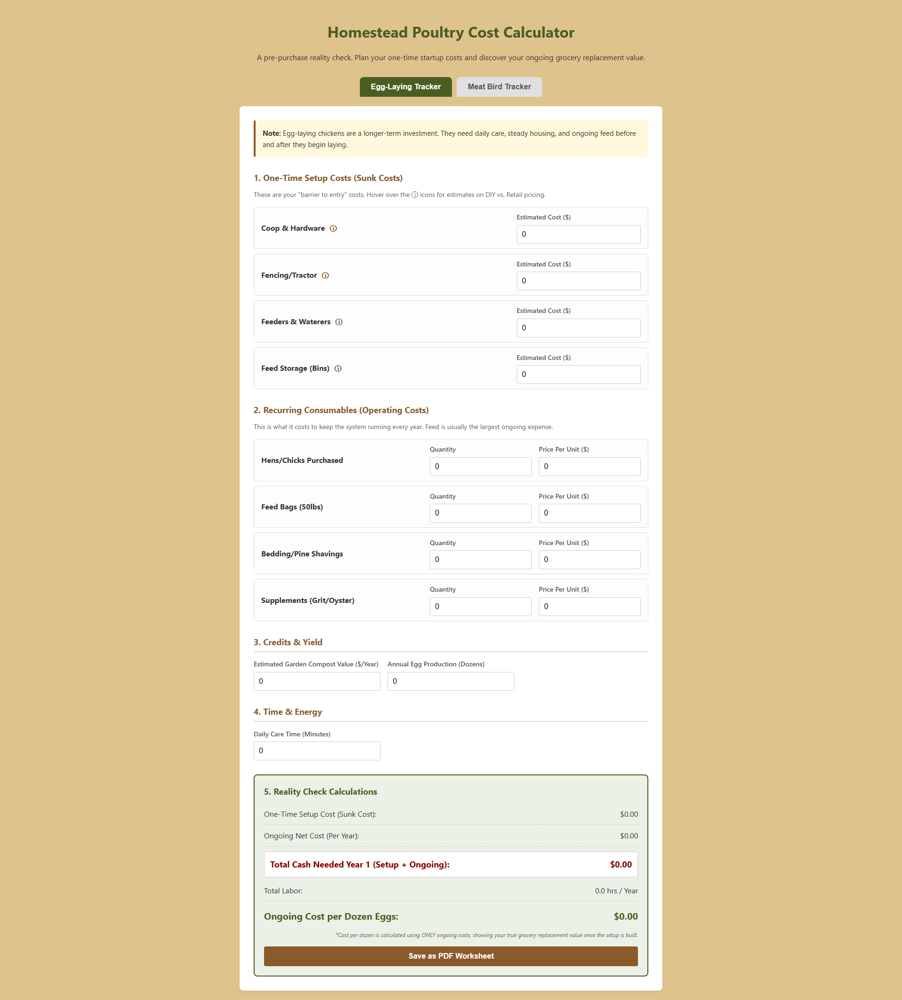
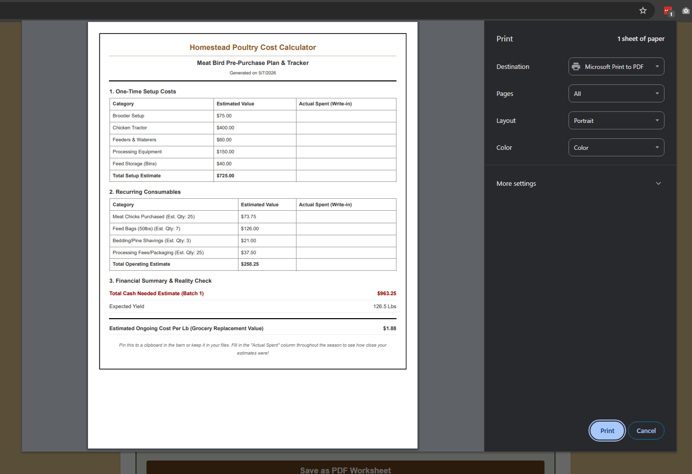

# 🐔 Homestead Poultry Cost Calculator

A practical planning tool for backyard farmers, homesteaders, and small-scale poultry keepers.

This calculator helps answer one of the most important questions before starting poultry:

**“Will this actually save me money… and how much cash do I really need to get started?”**

Instead of only calculating feed costs, this tool separates:

✅ One-time setup investments
✅ Ongoing operating expenses
✅ Labor and time commitment
✅ Compost / byproduct value
✅ True grocery replacement cost

Whether you're raising **egg layers** or **meat birds**, this app gives you a realistic financial picture before buying your first chick.

---

## Features

### 🥚 Egg-Laying Tracker

Plan and analyze:

- Coop and fencing costs
- Feed, bedding, supplements
- Annual egg production
- Compost value offsets
- Daily care time
- Cost per dozen eggs
- First-year total investment

### 🍗 Meat Bird Tracker

Track batch profitability:

- Brooder and tractor setup
- Chick and feed costs
- Processing and packaging costs
- Batch duration
- Meat yield
- Labor per batch
- Cost per pound of meat

### 📄 Printable Worksheets

Generate a printer-friendly worksheet that includes:

- Estimated costs
- Blank “Actual Spent” columns
- Financial summary
- Yield and cost breakdown

Perfect for:

- Barn clipboards
- Budget binders
- Seasonal records
- Family planning meetings

---

## Screenshots




---

## Why This Exists

A lot of people start poultry thinking:

> “Fresh eggs will save us money.”

or

> “Raising our own meat will be cheaper.”

Sometimes that's true.

Sometimes the coop, fencing, feed, bedding, labor, and equipment say otherwise.

This tool gives you a **pre-purchase reality check** before investing hundreds—or thousands—of dollars.

---

## Tech Stack

Built with:

- HTML5
- CSS3
- Vanilla JavaScript

No frameworks. No dependencies. Just open and run.

---

## Installation

Clone the repository:

```bash
git clone https://github.com/TristanEDU/poultry-cost-calculator.git
cd poultry-cost-calculator
```

Run locally:

```bash
open index.html
```

Or with a local server:

```bash
npx serve .
```

---

## Testing

For development and testing purposes, you can use this browser console script to auto-fill all fields with sample data and trigger calculations:

```js
/**
 * Auto-fill script for Poultry Cost Calculator Testing
 * This script populates all input fields for both tabs and triggers calculations.
 */
(function autoFillPoultryCalculator() {
  console.log("🚀 Starting auto-fill for testing...");

  const testData = {
    // --- Egg-Laying Tracker Inputs ---
    "e-cap-1-cost": 350.0, // Coop & Hardware
    "e-cap-2-cost": 120.0, // Fencing
    "e-cap-3-cost": 45.0, // Feeders
    "e-cap-4-cost": 30.0, // Storage

    "e-op-1-qty": 6, // Hens
    "e-op-1-price": 15.0,
    "e-op-2-qty": 12, // Feed bags per year
    "e-op-2-price": 22.0,
    "e-op-3-qty": 4, // Bedding
    "e-op-3-price": 8.0,
    "e-op-4-qty": 2, // Supplements
    "e-op-4-price": 12.0,

    "egg-compost": 50.0, // Credits
    "egg-production": 150, // Dozens
    "egg-daily-time": 15, // Minutes

    // --- Meat Bird Tracker Inputs ---
    "m-cap-1-cost": 40.0, // Brooder
    "m-cap-2-cost": 200.0, // Tractor
    "m-cap-3-cost": 60.0, // Feeders
    "m-cap-4-cost": 30.0, // Processing Gear
    "m-cap-5-cost": 30.0, // Storage

    "m-op-1-qty": 25, // Chicks
    "m-op-1-price": 2.5,
    "m-op-2-qty": 8, // Feed bags
    "m-op-2-price": 25.0,
    "m-op-3-qty": 3, // Bedding
    "m-op-3-price": 8.0,
    "m-op-4-qty": 25, // Processing fees
    "m-op-4-price": 1.5,

    "meat-compost": 20.0,
    "meat-birds-count": 23, // Accounting for some mortality
    "meat-avg-weight": 5.5,
    "meat-daily-time": 20,
    "meat-batch-days": 56, // 8 weeks
  };

  // Fill all fields defined in the testData object
  Object.keys(testData).forEach((id) => {
    const input = document.getElementById(id);
    if (input) {
      input.value = testData[id];
      // Dispatch 'input' event to trigger the oninput attributes in your HTML
      input.dispatchEvent(new Event("input", { bubbles: true }));
    } else {
      console.warn(`⚠️ Input with ID "${id}" not found.`);
    }
  });

  // Explicitly call calculation functions from your script.js
  if (typeof calculateEggTotals === "function") calculateEggTotals();
  if (typeof calculateMeatTotals === "function") calculateMeatTotals();

  console.log("✅ Auto-fill complete. Calculations updated.");
})();
```

**Usage:** Copy the script above, open the calculator in your browser, open the Developer Console (F12), paste the script, and press Enter to auto-fill all fields with test data.

---

## How It Works

### Step 1: Enter Setup Costs

Examples:

- Coop
- Fencing
- Feed storage
- Feeders / waterers
- Processing gear

These are treated as **sunk costs**.

---

### Step 2: Enter Operating Costs

Examples:

- Birds or chicks
- Feed
- Bedding
- Supplements
- Processing fees

These represent your recurring costs.

---

### Step 3: Enter Yield

For layers:

- Dozens of eggs per year

For meat birds:

- Birds processed
- Average dressed weight

---

### Step 4: Reality Check

The calculator outputs:

- Total startup cost
- Ongoing net cost
- Labor commitment
- Grocery replacement value
- Cost per dozen eggs or pound of meat

---

## Philosophy

This project is designed around **honest homesteading economics.**

Not:

> “Can chickens make me money?”

But:

> “What does this actually cost, and is it worth it for my family?”

---

## Roadmap

Future ideas:

- Breed-specific feed efficiency
- Mortality tracking
- Hatchery comparisons
- Multi-year ROI modeling
- Feed price history
- Mobile app version
- Export to CSV

---

## Contributing

Ideas, fixes, and improvements are welcome.

1. Fork the repo
2. Create a branch
3. Commit your changes
4. Open a pull request

---

## Author

Built by **Tristan**

Focused on practical tools for homesteaders, makers, and real-world decision-making.

GitHub: `@TristanEDU`
